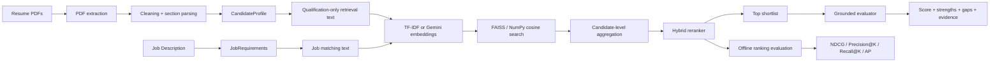

# HireFlow

**Explainable candidate retrieval, hybrid ranking, offline evaluation, and grounded LLM assessment.**

HireFlow is a production-oriented ML engineering portfolio project that ranks candidate resumes against a job description while keeping **retrieval**, **deterministic scoring**, **evaluation**, and **LLM explanation** separate and measurable.

The project was built from a supplied Senior Accountant job description and 50 resume PDFs. The public repository deliberately excludes raw resumes, candidate contact data, generated private profiles, API keys, and runtime vector indexes.

> **Release:** v1.0.0 · Portfolio-ready reference implementation

## Why this project is different from a basic RAG demo

A simple resume RAG demo often does this:

```text
JD → embedding similarity → LLM → score
```

HireFlow instead uses a staged architecture:



The numeric ranking is deterministic. Gemini, when enabled, **explains the ranking but does not control the fit score**.

## What this repository demonstrates

- PDF ingestion and section-aware resume parsing
- Pydantic data contracts for candidates, jobs, matches, and evaluations
- TF-IDF baseline retrieval plus optional Gemini embeddings
- FAISS exact inner-product search with a portable NumPy cosine fallback
- Candidate-level aggregation over retrieved sections
- Hybrid ranking across semantic fit, requirements, experience, role, and preferred criteria
- Evidence-backed explanations with server-side evidence IDs
- Hallucination controls for LLM-generated narratives
- Offline ranking evaluation with graded relevance labels
- Reproducible experiment artifacts and metrics
- Streamlit recruiter application
- FastAPI serving surface
- Search caching and corpus-index synchronization
- Prometheus metrics, request IDs, and structured logging
- Docker, Docker Compose, GitHub Actions, tests, and release validation
- Privacy-aware handling of candidate identity/contact information

## Evaluated result on the supplied dataset

The Phase 4 evaluation uses a project-authored **silver benchmark** with graded labels (`0 = not suitable`, `3 = strong fit`) for one Senior Accountant JD and 50 resumes.

| Experiment | P@5 | P@10 | Strong@5 | Strong@10 | NDCG@5 | NDCG@10 | Average Precision |
|---|---:|---:|---:|---:|---:|---:|---:|
| TF-IDF full-resume retrieval | 0.60 | 0.80 | 0.00 | 0.40 | 0.338 | 0.534 | 0.759 |
| TF-IDF section-aware retrieval | 0.60 | 0.70 | 0.00 | 0.20 | 0.318 | 0.411 | 0.699 |
| **Full-resume + hybrid reranking** | **1.00** | **1.00** | **1.00** | **0.80** | **1.000** | **0.926** | **0.988** |
| Section-aware + hybrid reranking | 1.00 | 1.00 | 1.00 | 0.80 | 1.000 | 0.918 | **0.989** |

The main result is not that the benchmark is universally solved; it is that the experiment demonstrates a measurable failure mode of lexical semantic retrieval and a clear gain from explicit requirement-aware reranking on this dataset.

**Important:** this is a single-JD benchmark with project-authored labels. These numbers are descriptive, not a generalization estimate for real-world hiring.

See [docs/RESULTS.md](docs/RESULTS.md) and [docs/benchmark_rubric.md](docs/benchmark_rubric.md).

## Public demo — no private resumes required

The repository includes a small synthetic structured-search example so a reviewer can run the core pipeline without access to the original resume dataset.

```bash
python -m venv .venv

# macOS/Linux
source .venv/bin/activate

# Windows PowerShell
# .venv\Scripts\Activate.ps1

python -m pip install --upgrade pip
pip install -r requirements.txt
make demo
```

Expected behavior: the strongest synthetic accounting candidate should rank above a related financial analyst and a junior accounting assistant.

The demo request lives in:

```text
examples/structured_search_request.json
```

## Running with your own PDFs

Place private files locally — they are ignored by Git:

```text
data/raw/jobs/
data/raw/resumes/
```

Then run:

```bash
PYTHONPATH=src python scripts/ingest_dataset.py \
  --job data/raw/jobs/job.pdf \
  --resume-dir data/raw/resumes
```

Or use the Streamlit application and upload the files interactively:

```bash
make run
```

The app supports one JD PDF plus either multiple resume PDFs or a ZIP of resume PDFs.

## Optional Gemini configuration

Offline mode works without any hosted model:

```text
TF-IDF + NumPy/FAISS + hybrid reranking + heuristic grounded evaluator
```

To enable Gemini embeddings and/or grounded explanations:

```bash
cp .env.example .env
```

Then set:

```text
GEMINI_API_KEY=your_key_here
```

Secrets are ignored by Git. Gemini receives qualification evidence, not candidate contact information, and cannot modify the deterministic numeric fit score.

## Streamlit product

```bash
make run
```

The recruiter UI supports:

- JD and resume/ZIP upload
- retrieval/evaluator configuration
- ranked shortlist
- fit-score breakdown
- strengths and evidence gaps
- supporting resume evidence
- experience and role filters
- CSV/JSON export
- model/evaluation transparency page

## FastAPI service

```bash
make api
```

Key endpoints:

```text
GET  /health/live
GET  /health/ready
GET  /metrics
POST /v1/search/structured
POST /v1/search/files
```

Interactive API docs are available at `/docs` outside production mode.

The public response intentionally excludes candidate full names, contact information, and raw resume text.

## Docker

```bash
docker build -t hireflow:1.0.0 .
docker run --rm -p 8000:8000 --env-file .env hireflow:1.0.0
```

With Docker Compose:

```bash
# API only
docker compose up --build

# API + Streamlit
docker compose --profile ui up --build
```

## Tests and validation

```bash
make test
make lint
make validate-release
```

GitHub Actions runs the test suite on Python 3.11 and 3.12 and builds the production Docker image.

## Repository layout

```text
hireflow/
├── app/                       # Streamlit presentation layer
├── examples/                  # Public synthetic demo request
├── artifacts/
│   └── evaluation/            # Public-safe experiment outputs
├── configs/                   # Scoring, taxonomy, evaluation config
├── data/
│   ├── raw/                   # Private/local only
│   ├── processed/             # Private/local only
│   └── evaluation/            # PII-free silver benchmark
├── docs/                      # Architecture, results, deployment, interview notes
├── scripts/                   # Ingestion, indexing, evaluation, validation, demo
├── src/hireflow/
│   ├── api/
│   ├── embeddings/
│   ├── evaluation/
│   ├── ingestion/
│   ├── models/
│   ├── observability/
│   ├── parsing/
│   ├── preprocessing/
│   ├── product/
│   ├── production/
│   ├── ranking/
│   └── retrieval/
├── tests/
├── Dockerfile
├── docker-compose.yml
└── pyproject.toml
```

## Core design decisions

### 1. Ranking is not delegated to the LLM

The final fit score is computed from auditable components:

```text
25% semantic relevance
30% required requirements
15% experience alignment
20% role/seniority alignment
10% preferred criteria
```

These weights are configuration, not universal business truth.

### 2. Missing evidence is not treated as proof of absence

HireFlow says:

> "Direct evidence for GAAP was not found in the resume."

not:

> "The candidate does not know GAAP."

### 3. Candidate identity is separated from scoring

Name, email, phone, LinkedIn, and location may be retained for recruiter display but are excluded from matching text, deterministic evidence matching, benchmark criteria, and Gemini prompts.

### 4. TF-IDF remains as a baseline

The project intentionally keeps a simple lexical baseline. This makes it possible to measure whether more complex retrieval methods actually improve ranking quality instead of assuming they will.

### 5. Section-aware retrieval is an experiment, not a dogma

On this supplied synthetic/template-heavy dataset, section-aware TF-IDF underperformed full-resume TF-IDF. The project preserves that finding rather than hiding an experiment that did not win.

## Performance smoke measurements

On the supplied 50-resume dataset in the build environment using TF-IDF + NumPy exact search + heuristic evaluation:

- cold file-based run: ~576 ms
- repeated request: ~299 ms overall
- warm search-cache lookup after parsing: ~1.3 ms
- first persistent TF-IDF sync: 50/50 documents embedded
- unchanged second sync: 50/50 embeddings reused

These are environment-specific smoke measurements, **not production SLAs**.

## Responsible-use boundary

HireFlow is a **decision-support** system, not an autonomous hiring decision maker. A production deployment should add independent bias/fairness testing, human review, candidate data governance, access control, audit retention, encryption, and legal/compliance review appropriate to the deployment jurisdiction.

See [docs/RESPONSIBLE_AI.md](docs/RESPONSIBLE_AI.md).

## Documentation

- [Architecture](docs/architecture.md)
- [Evaluation results](docs/RESULTS.md)
- [Benchmark rubric](docs/benchmark_rubric.md)
- [Demo walkthrough](docs/DEMO_GUIDE.md)
- [Deployment](docs/DEPLOYMENT.md)
- [Responsible AI](docs/RESPONSIBLE_AI.md)
- [Interview guide](docs/INTERVIEW_GUIDE.md)
- [Production engineering](docs/phase6_production_engineering.md)

## Limitations and next steps

Current limitations:

- one supplied JD in the evaluated benchmark
- only 50 resumes
- labels are project-authored silver labels
- supplied resumes are highly synthetic/template-driven
- live Gemini calls were not part of the offline benchmark results
- current taxonomy is accounting-focused
- no fairness/generalization claim is made

High-value extensions:

- add multi-role, multi-JD human-reviewed evaluation data
- evaluate dense embeddings against a held-out test set
- add a learned/cross-encoder reranker
- externalize the vector store for large corpora
- add asynchronous ingestion workers
- add multi-tenant authorization and encrypted candidate stores
- add fairness and subgroup-performance evaluation where legally and ethically appropriate

## License

MIT. See [LICENSE](LICENSE).
