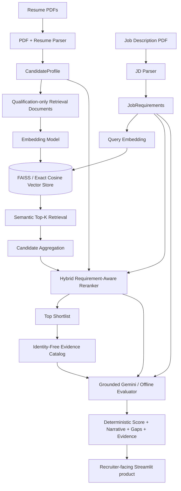
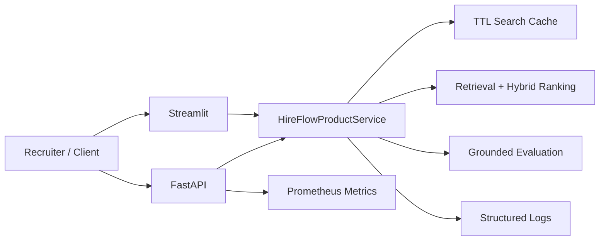

# HireFlow Architecture

## Design principles

1. **Retrieve before reasoning** — vector retrieval reduces the candidate set before LLM evaluation.
2. **Separate ranking from explanation** — deterministic ranking chooses candidates; the LLM explains evidence.
3. **Ground every assessment** — missing evidence is reported as "not found", never invented as a negative fact.
4. **Keep PII out of matching features** — identity remains display metadata, not retrieval/ranking/evaluation input.
5. **Make experiments configurable** — retrieval sizes and hybrid weights live in configuration.
6. **Evaluate before optimizing** — architectural changes must beat a measured baseline.
7. **Prefer reproducible baselines** — lexical retrieval remains available after dense retrieval is introduced.
8. **Do not let an LLM silently redefine ranking** — final score is deterministic and auditable.

## Final implemented architecture



## Retrieval layer

Two retrieval-document modes exist:

- `full`: one qualification-only vector per candidate;
- `section`: summary, skills/software, experience, education/certification vectors.

Two vector backends share one interface:

- FAISS `IndexFlatIP` for normalized cosine-style retrieval;
- NumPy exact cosine search for deterministic CI/offline fallback.

Two embedding providers are represented:

- TF-IDF word 1–2 grams as the reproducible baseline;
- Gemini embeddings as the dense hosted alternative.

## Intelligence layer

Phase 3 reranks semantic candidates with five components:

```text
25% semantic relevance
30% required-requirement alignment
15% experience alignment
20% role/seniority alignment
10% preferred criteria
```

The required component combines accounting concept coverage, software coverage, and education alignment. Accounting concepts and aliases are externalized in `configs/matching_taxonomy.yaml`.

## Evidence architecture

`CandidateProfile` retains PII for future UI display, but `build_evidence_catalog()` emits only:

- headline;
- professional summary;
- skills;
- software;
- experience and responsibilities;
- education;
- certifications.

Each evidence item receives a stable ID (`E001`, `E002`, ...).

Gemini may reference those IDs but may not provide its own evidence text. HireFlow resolves the referenced evidence server-side and rejects unknown evidence IDs.

## LLM responsibility boundary

Gemini is not permitted to set the final score.

```text
Semantic retrieval + explicit features
              ↓
      deterministic score
              ↓
      shortlist + evidence
              ↓
       Gemini explanation
```

This avoids unstable reranking caused by generative sampling and makes the final score reproducible.

## Phase 4 evaluation architecture

```text
                         OFFLINE EVALUATION

Senior Accountant JD ───────────────────────────────────────────────┐
                                                                    │
50 candidate IDs ── Silver relevance labels (0..3)                  │
        │                                                           │
        └──────────────┐                                            │
                       ▼                                            ▼
                Benchmark loader                       Retrieval / reranking experiment
                       │                                            │
                       └─────────────────┬──────────────────────────┘
                                         ▼
                                  Ranking metrics
                    ├── Precision@K / Recall@K
                    ├── StrongFit@K
                    ├── MRR / Average Precision
                    └── NDCG@K (graded relevance)
                                         │
                                         ▼
                                Experiment artifacts
                       JSON + CSV + Markdown report
```

Evaluation retrieves all candidates rather than only the production shortlist. This keeps first-stage retrieval failures visible during offline analysis.

## Phase 5 product boundary

The Streamlit application does not assemble ML components itself. `HireFlowProductService` owns parsing, indexing, retrieval, reranking and grounded evaluation, returning a validated `ProductSearchBundle`. This boundary keeps the UI replaceable and makes the same application logic reusable by the Phase 6 API/worker layer.

```text
Streamlit upload / recruiter controls
                │
                ▼
      HireFlowProductService
                │
   ┌────────────┼─────────────┐
   ▼            ▼             ▼
Parsing     Retrieval      Evaluation
   │            │             │
   └────────────┼─────────────┘
                ▼
      ProductSearchBundle
                │
       ┌────────┼────────┐
       ▼        ▼        ▼
   shortlist  detail   exports
```

Interactive PDFs are staged in a temporary workspace. Contact fields are available only in the recruiter detail panel and are not added back into matching or LLM evidence.


## Production serving boundary

Both Streamlit and FastAPI call the same `HireFlowProductService`. The API adds request IDs, privacy-minimized response contracts, Prometheus metrics, optional API-key protection and worker-thread execution for the synchronous ML pipeline.



For horizontally scaled production use, local cache/index state should be externalized.
